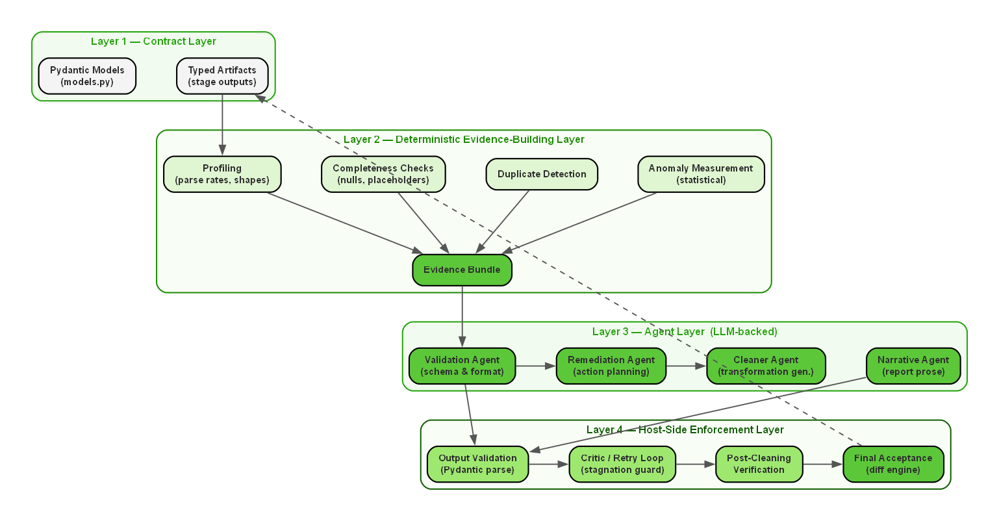
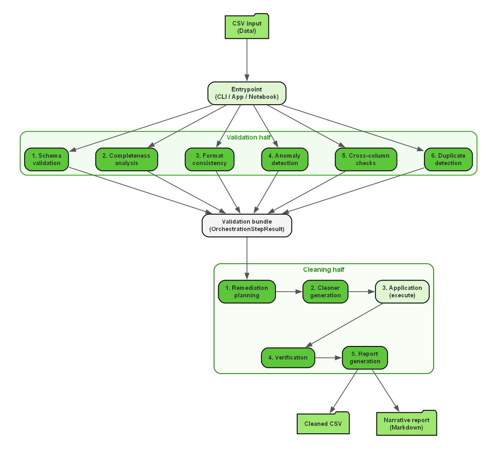

# NoiPA: Multi-Agent System for Data Quality

**Student team:** Michele Turco, Mattia Sebastiani, Sofia Bruni.

A project provided by **Reply** for the **Machine Learning** group project at **LUISS Guido Carli**, academic year **2025/2026**. The system inspects CSV datasets, identifies data-quality issues, applies selected repairs, and reports what changed. It combines deterministic Python checks with specialized AI agents, with a focus on administrative and payroll-related tabular data.

## Architecture



Pandas builds the evidence; Pydantic models define the artifacts exchanged between stages. Agents infer types, assess formatting, generate cleaners, and explain findings. Local checks validate generated transformations before application. The diagram groups conceptual roles; remediation planning is implemented by deterministic rules.



Validation covers schema, completeness, consistency, anomalies, cross-column relationships, and duplicates. Cleaning turns findings into actions, generates and checks column cleaners, applies repairs, and verifies the output. The Streamlit app and CLI use the modules in `src/core/`, `src/tools/`, `src/validation/`, and `src/cleaning/`.

## Setup

Clone or download this repository and open a terminal in its root folder. You need Python with pip, internet access for installation and model calls, and an OpenAI API key.

**Windows PowerShell**

```powershell
python -m venv .venv
.\.venv\Scripts\Activate.ps1
python -m pip install -r requirements.txt
```

**macOS / Linux**

```bash
python3 -m venv .venv
source .venv/bin/activate
python -m pip install -r requirements.txt
```

These commands use the current dependency file. A supported Python version range, dependency locks, and fresh cross-platform installation checks are part of the upcoming environment review; Docker support is also planned.

Create a local `.env` file in the repository root:

```dotenv
OPENAI_API_KEY=replace_with_your_key
LOGFIRE_SEND=0
```

The key is required for agent-backed stages. Logfire tracing is optional and disabled above; see [configuration details](docs/architecture.md#environment-and-operation). Keep `.env` private. Agent calls incur API charges and can include sampled cell values. Generated cleaners execute Python locally; validation does not provide a security sandbox.

## Run the application

```bash
python -m streamlit run app.py
```

Open the local URL printed in the terminal. Select a CSV from the app's `Data/` folder or upload one, then run the pipeline and inspect the report and cleaned output. The current uploader saves files using their supplied names, so use a distinct filename to avoid overwriting an existing file.

On case-sensitive systems, `Data/` and the tracked `data/` folder are different. Create `Data/` and place your chosen CSV there, or use the uploader. Path normalization and dataset untracking are planned separately.

For the CLI, replace the example path with an existing CSV path:

```bash
python -m src.entrypoints.main "path/to/dataset.csv" --stage validate
python -m src.entrypoints.main "path/to/dataset.csv" --stage clean --reuse-validation
python -m src.entrypoints.main --help
```

Validation caches are stored beside the input in `.validation_cache/`. Cleaned CSVs, generated cleaners, and reports are stored in `.cleaning_cache/<dataset-name>/`. See [operation and available stages](docs/architecture.md#environment-and-operation) for details.

## Documentation

[Detailed documentation](docs/README.md) · [Project presentation (PDF)](ReplyProject.pdf)

The documentation covers the project background, architecture, validation, cleaning, historical experiments, and limitations. `docs/` is the authoritative source; GitHub Wiki synchronization is planned. The existing notebook will remain until its unique material has been migrated and the maintained application has been verified.
