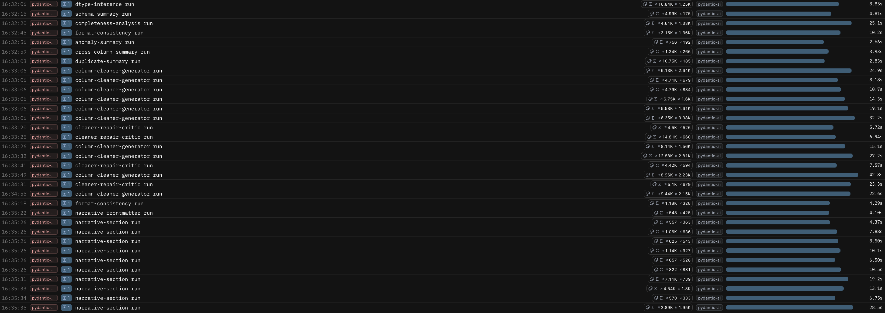

# Architecture

## General System Architecture and Conceptual Design

The **overall architecture** is based on a **strict separation** between inspection, diagnosis, remediation planning, transformation, and verification. This choice reflects the view that heterogeneous data-quality problems are handled more safely when the workflow is decomposed into narrower stages with explicit responsibilities.


A **broad architectural overview** of the system is useful because it makes visible the **main split between the validation half and the cleaning half**, while still preserving the end-to-end flow from raw CSV input to cleaned dataset and narrative report.

The workflow begins by **loading a dataset** and **building deterministic evidence** about it, then **translating those observations** into **structured findings**. Only after those have been formalized does the system decide whether a **corrective action** is **justified**. When executable **cleaning logic** is needed, the latter is **generated** under a **narrow contract** and is **validated** by the host system before being trusted. After application, the dataset is checked again to confirm that the **targeted issue** was actually reduced.

This architecture serves **two purposes**. The first is **technical safety**. If one stage fails, the failure can be localized instead of contaminating the rest of the workflow invisibly. The second is **interpretability**. Because every stage emits a specific typed artifact, the intermediate state of the system can be inspected, cached, reloaded, and discussed both in the notebook and in the final report.

Conceptually, the system can be read as a **four-layer architecture**. The **first layer** is the **contract layer**, in which [Pydantic](https://docs.pydantic.dev/latest/) models define the typed artifacts exchanged across stages. The **second layer** is the **deterministic evidence-building layer**, in which local Python code measures parse rates, shapes, placeholders, duplicates, and anomalies without asking the model to rediscover raw facts. The **third layer** is the **agent layer**, where LLMs are used only for narrow interpretive or generative tasks that benefit from bounded reasoning. The **fourth layer** is the **host-side enforcement layer**, which remains the final authority whenever generated outputs must be validated before acceptance.


This is a conceptual diagram: its "Remediation Agent" label represents the planning role. The current remediation planner is deterministic Python in `src/cleaning/remediation.py`, rather than a separate model-backed agent. The pipeline overview groups stages by responsibility; its arrows do not imply all validation stages execute in parallel.

This decomposition is important because it explains why the pipeline remains both flexible and auditable: interpretation is delegated selectively, while structure, evidence, and final acceptance stay under explicit programmatic control.

## Contract Layer and Typed Artifacts
One of the defining engineering choices of the system is the use of **[Pydantic](https://docs.pydantic.dev/latest/) models** as a **contract layer**. The file `src/core/models.py` defines the **structured objects** that move from one stage to another. In this context, a **schema** is an explicit description of what a stage is allowed to produce and what a downstream stage is allowed to expect. This means that the **output** of a stage is not a free-form paragraph that must later be reinterpreted, but a **validated artifact** with an explicit **schema**.

For example, a raw column may arrive in pandas as generic `object` data, while the schema-stage handoff can still declare that the cleaned target should be `datetime64[ns]` with a canonical `ISO 8601 / date-time` pattern. Downstream stages then receive not just "some text about the column," but a structured statement of what that column is supposed to become after cleaning.

This choice is central to the **reliability of the pipeline**. In an **agentic workflow**, one of the main **risks** is not only that a stage may produce an incorrect answer, but that it **may produce an answer with the wrong structure**. A **malformed handoff** can **silently poison every downstream stage**. Typed artifacts reduce this risk and improve traceability. They also make it possible to cache intermediate results, compare runs, and expose internal state clearly in the notebook and in the application.

## Agent Runtime, Retries, and Observability

All **agents are defined** centrally in `src/core/agents.py`, and all runtime control is routed through **shared utilities**. This layer exists because **LLM calls** are the **least deterministic** and most failure-prone component of the pipeline. Rate limits, transient connection failures, and inconsistent retry logic would make the system difficult to reason about if every module handled them independently.

The runtime therefore **centralizes model configuration**, tracing, and retry policy. **Logfire** is used for **observability**. The **current configuration** in `src/core/agents.py` sets the shared model to `openai-responses:gpt-5.4-nano`, although the design allows the model choice to be changed in one place rather than scattered across the codebase. This **centralization supports repeatability and debugging**: a failed agent call can be inspected as a single event inside a larger engineered process.



The Logfire trace displays **individual agent runs as separate observable events**, therefore making the **operational structure** of the pipeline visible during execution, rather than only after the final artifacts have been written. This makes it possible to audit exactly what the pipeline did during a run, at what cost, and where failures or retries occurred.

## Design Choices and Prompt Strategy

**[Pydantic](https://docs.pydantic.dev/latest/)** and **[Pydantic AI](https://ai.pydantic.dev/)** were chosen because the system depends on strict **structured handoffs** between many stages. A **looser conversational orchestration framework** would have made **debugging and validation significantly harder**, because almost every stage in this pipeline must produce an artifact that can be inspected and reused by the next stage.

The **prompt strategy** follows the same engineering logic. The prompt is **not** treated as the component that performs the work by itself. Its role is to **delimit what the agent is allowed to do**: which evidence is authoritative, which decision it is being asked to make, which facts it must not invent, and which typed output it must return. In practice, the schema agent is asked to infer a cleaned dtype from bounded profiling evidence, the consistency agent is asked to judge whether an inconsistency is truly actionable, and the generator agent is asked to write one cleaning function that satisfies an explicit contract rather than improvising a free-form remediation plan. The purpose of the prompt is therefore to **bound the agent's role inside the pipeline**, not to replace the pipeline itself.

For example, a format-consistency call is framed as a **narrow decision over a structured attachment**, not as an open request to "clean the column." A shortened instruction block looks like this:

```text
You are the column-level Format Consistency agent.
You receive a ColumnFormatFacts document for one column and must decide
whether a format inconsistency exists and, if so, describe it precisely
for the downstream cleaning agent.

Decision rules:
- return finding = null if machine_format_candidate is false,
  dominant_shape_pct is below threshold, or inconsistent_rows is 0
- return finding = null for descriptive or free-text columns
- only report a finding when there is a clear dominant format
  and a measurable set of outliers that a cleaning function could fix

When you report a finding:
- expected_pattern must describe one canonical target format only
- example_inconsistent_values must copy the provided outlier values verbatim
- evidence must cite dominant_shape, dominant_shape_pct, inconsistent_rows,
  and the target dtype
- suggested_strategy must specify how each outlier shape should be transformed
```

The important point is that the **prompt does not create the evidence**. The evidence has already been measured and packaged upstream. The prompt only tells the agent how to operate over that bounded evidence and what kind of output artifact it is allowed to produce.

The **prompt design** is also **intentionally token-conscious**. The **system generally does not send full raw columns to the model**. It sends **bounded profiles**, **capped samples**, **representative examples**, and **structured local facts**. This **reduces cost** and **encourages the model to reason over distilled evidence rather than over long noisy inputs**. Provider-side **code-execution capability** is enabled only for the `completeness-analysis` and `column-cleaner-generator` agents, and even there it is **bounded**. The system therefore uses tool execution as a narrow controlled capability rather than as a free-form sandbox. In particular, the cleaner generator may use sandboxed execution to test a candidate function on bounded examples, but this self-test is **not** the final acceptance criterion: the decisive authority remains the later **host-side validator**, which re-checks the returned code deterministically before a cleaner is accepted for application. Local execution still uses Python `exec` and is not a security sandbox; see the [execution boundary](cleaning-and-reporting.md#execution-boundary).

Another important design choice is the default use of **`temperature = 0`** for the main operational agents in `src/core/agents.py`, including schema inference, completeness analysis, format consistency, and cleaner generation. The reason is not that the outputs become literally mathematically deterministic in every circumstance, but that the system wants them to be **as stable and reproducible as possible** when the same bounded evidence is presented again. In this project, unnecessary variation is usually harmful: a small gratuitous change in inferred dtype, cleaning rationale, or branch structure can propagate downstream into validation mismatches, different remediation decisions, or harder-to-debug retry behavior. For that reason, the default prompt configuration is deliberately conservative. Only when the cleaning loop detects **stagnation** does the system intentionally relax that setting and raise temperature to encourage a meaningfully different repair attempt.

## Repository and execution surfaces

| Location | Responsibility |
|---|---|
| `app.py` | Streamlit interface and interactive stage orchestration |
| `src/entrypoints/cli.py` | CLI argument parsing and stage dispatch |
| `src/entrypoints/main.py` | Module entry point for the CLI |
| `src/core/` | Agent configuration, Pydantic models, and artifact caches |
| `src/tools/` | Deterministic profiling and data-quality checks |
| `src/validation/` | Schema, completeness, consistency, anomaly, cross-column, and duplicate stages |
| `src/cleaning/` | Remediation, requests, generation, application, verification, and reporting |
| `images/` | Architecture diagrams and historical result figures |
| `main.ipynb` | Existing exploratory/explanatory notebook; retirement is planned after migration and verification |

The app and CLI call shared stage modules, but maintain distinct orchestration paths. The notebook is retained for now and is not the recommended application entry point. Dataframe operations use pandas; Pydantic and Pydantic AI define agent contracts; dateutil/dateparser support date cleaning; Streamlit provides the UI; Logfire provides optional tracing.

## Environment and operation

See the [README setup instructions](../README.md#setup) for Windows, macOS, and Linux. The existing `requirements.txt` remains the installation source for this documentation stage. Dependency splitting, generated locks, and Docker are planned separately; a fresh cross-platform installation has not been certified by this migration.

The application reads CSVs through `pandas.read_csv`. The CLI accepts an explicit CSV path, including an absolute path outside the repository; relative paths are resolved from the repository root. Its default is `Data/spesa.csv`. The app lists files under uppercase `Data/` and saves uploads there using their supplied filename. A same-name upload can overwrite an existing file. Dedicated upload storage is planned, not implemented.

Git currently tracks sample files under lowercase `data/`. On a case-sensitive filesystem, use the actual path for the CLI, or create uppercase `Data/` and place your chosen CSV there for the app. The future path and tracking cleanup will remove this discrepancy; the current README uses explicit user-supplied CSV paths.

Validation artifacts are written to `<dataset-directory>/.validation_cache/`. Cleaning artifacts live under `<dataset-directory>/.cleaning_cache/<dataset-stem>/`, including generated cleaners, the cleaned CSV, manifests, and reports. These caches and the local `.env` are ignored by Git. Avoid reusing artifacts after replacing an input file unless you have verified they correspond to that input.

`OPENAI_API_KEY` is required for model-backed stages. `LOGFIRE_SEND=0` disables remote tracing. To enable it, supply `LOGFIRE_TOKEN` and remove that override or set `LOGFIRE_SEND=1`. `LOGFIRE_ENVIRONMENT` sets the tracing environment; `LOGFIRE_CAPTURE_HTTPX=1` enables additional HTTP capture. Tracing can contain dataset evidence, so configure it deliberately.

The CLI exposes `validate`, `dtype`, `schema`, `completeness`, `consistency`, `remediate`, `generate`, `apply`, `verify`, `clean`, and `report`. Use `--help` for cache reuse flags, cleaner attempts, column selection, verbosity, and optional concurrency. The `report` stage requires an existing final report from cleaning. The app currently generates cleaners sequentially; CLI concurrency is opt-in through `--concurrent-agents` and `--agent-workers`.

---

[Documentation index](README.md) · [Run the application](../README.md#setup)
