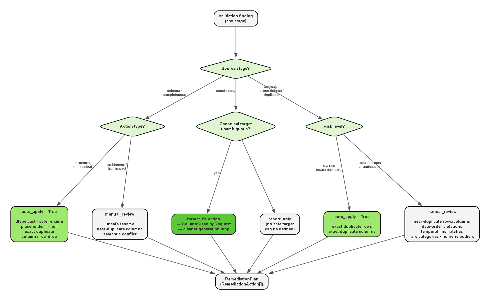
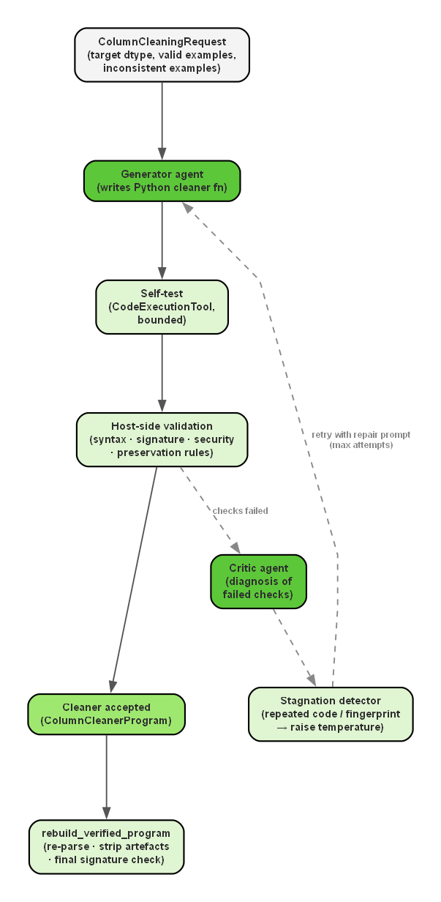
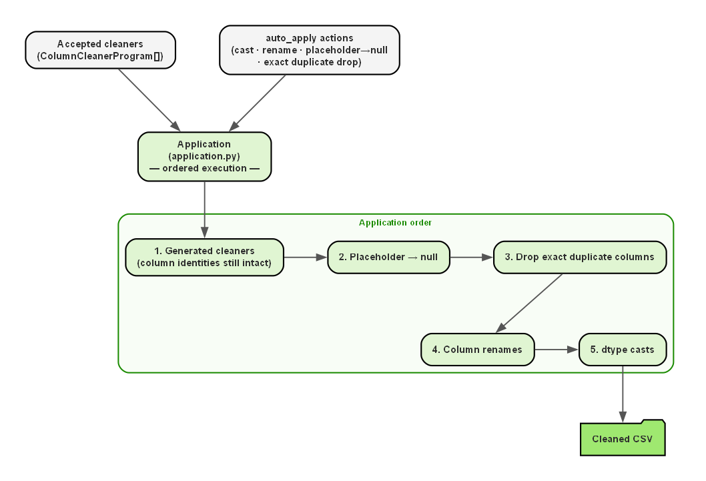
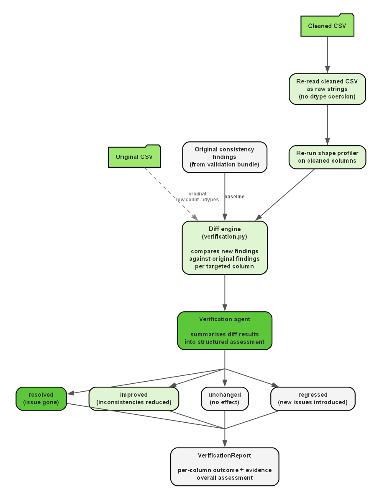
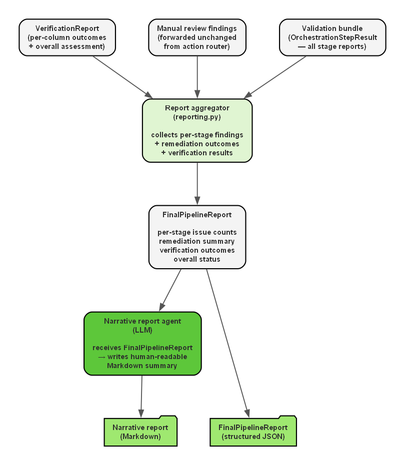

# Cleaning and reporting

Examples below illustrate contracts and historical artifacts; their counts need not match the [reported experiment](experiments-and-results.md).

## Remediation planning

The **remediation planner** in `src/cleaning/remediation.py` converts the validation bundle into a **structured list of RemediationAction objects**. This is the stage where **diagnostic findings are translated into explicit allowed interventions**. Low-risk and mechanically justified findings, such as safe column renames, dtype casts, placeholder-to-null replacement, exact duplicate-column removal, or exact duplicate-row removal, become auto-applicable actions.



``` json
{
  "dataset_name": "spesa",
  "actions": [
    {
      "action_id": "cast_dtype__aggregation_time__datetime64_ns",
      "action_type": "cast_dtype",
      "object_type": "column",
      "target": {
        "column_name": "aggregation_time",
        "target_dtype": "datetime64[ns]"
      },
      "source_check": "schema_validation",
      "confidence": "high",
      "risk_level": "low",
      "auto_apply": true,
      "status": "planned",
      "reason": "Cast the column to inferred dtype datetime64[ns].",
      "preview_stats": {
        "non_null_rows": 7543
      }
    },
    {
      "action_id": "rename_column__2cod_imposta__cod_imposta_2",
      "action_type": "rename_column",
      "object_type": "column",
      "target": {
        "column_name": "2cod_imposta",
        "new_name": "cod_imposta_2"
      },
      "source_check": "schema_validation",
      "confidence": "high",
      "risk_level": "low",
      "auto_apply": true,
      "status": "planned",
      "reason": "Column name contains a leading digit, which violates the lowercase snake_case naming rule.",
      "preview_stats": {
        "non_null_rows": 7543
      }
    }
  ]
}

```

**Findings** that are **more ambiguous**, such as anomalies, near-duplicate columns, semantic conflicts, temporal mismatches, date-order violations, or near-duplicate rows, are **converted** into `manual_review` or `report_only` actions instead of being executed automatically. This policy is especially important because the system has no **guaranteed knowledge** of the final analytical **purpose of the dataset**. A suspicious row, an anomaly, a disagreement between semantically similar columns, or a rare category may be simple noise, a dirty entry, a legacy encoding, or genuinely meaningful information that should be preserved because it could be useful or interesting for further analysis. Since that contextual knowledge is not available inside the raw dataset itself, the **pipeline adopts a conservative intervention strategy**: clear and low-risk transformations can be automated, but ambiguous findings are redirected to manual review rather than modified directly.

## Cleaning Request Construction

A **format-consistency finding** is not, by itself, a **sufficient contract for code generation**. Before code can be generated safely, the **system must construct a richer object** that states what the correct target looks like, which examples must remain unchanged, which examples must be transformed or nulled, and which output dtype the generated function must respect. This role is performed by the **cleaning request builder** in `src/cleaning/request.py` and related orchestration logic.

```json
{
  "dataset_name": "spesa",
  "column_name": "aggregation-time",
  "expected_pattern": "datetime format like '2024-03-11T02:01:04.421'",
  "semantic_hint": "temporal_period",
  "target_dtype": "datetime64[ns]",
  "target_role": null,
  "dominant_shape": "9999-99-99A99:99:99.999",
  "dominant_example_values": [
    "2024-03-11T02:01:04.421",
    "2024-07-11T03:01:16.866",
    "2024-09-11T03:01:11.704"
  ],
  "example_inconsistent_values": [
    "11/01/2024",
    "24/10/2024",
    "11-11-24",
    "2024/06/11",
    "GIU 11 2024"
  ],
  "enforce_year_only_yyyymm_january": false,
  "suggested_strategy": "Datetime output contract:\n- Preserve already-valid dominant timestamps unchanged, for example '2024-03-11T02:01:04.421'.\n- The cleaned output must use that same canonical datetime layout, including the same date order, separator style, time component, and fractional-second precision.\n- For date-only inputs, emit midnight in that same canonical layout.\n- Do not just replace separators blindly. Reorder components explicitly before formatting the final timestamp.\n\nExisting shape notes:\n- '11/01/2024' -> '2024-01-11T00:00:00.000'\n- '24/10/2024' -> '2024-10-24T00:00:00.000'\n- '11-11-24' -> '2024-11-11T00:00:00.000'\n- '2024/06/11' -> '2024-06-11T00:00:00.000'\n- 'GIU 11 2024' -> '2024-06-11T00:00:00.000'"
}
```

The resulting `ColumnCleaningRequest` is the **direct interface between validation and generation**. It is **particularly important for datetime-like columns**, where careless branch logic can easily damage values that were already valid. For example, a naive cleaner that rewrites any date-looking string could take an already valid value such as `2024-03-11T02:01:04.421`, drop the original time component and fractional seconds, or even reorder the date parts incorrectly while trying to normalize outliers such as `11/01/2024` or `11-11-24`. The **request object makes the preservation requirement explicit instead of leaving it implicit**. These bounded examples are later reused by the host-side validator, but they are no longer the only acceptance check: before a cleaner is accepted, the pipeline also performs a **full-column local dry run** on the target column, skipping nulls and placeholder-like tokens that belong to later cleaning stages.

## Cleaner Generation, Critic Loop, and Stagnation Control

**Executable cleaning logic** is generated only for columns where the system has already established that a **narrow normalization target** exists. For each `ColumnCleaningRequest`, the `column-cleaner-generator` agent is asked to **produce one self-contained Python function** that receives a scalar value and returns either a cleaned string or `None`. The generator begins from the same **`temperature = 0` baseline** used by the main operational agents, so that runs over the same bounded request remain as reproducible as possible unless the loop later detects stagnation.

This stage is intentionally **constrained**. The **generated code is allowed one grouped self-test** through `CodeExecutionTool`, and that permission is bounded in `src/cleaning/generation.py`. The **purpose of that self-test is limited**: it allows the model to try its function on representative already-valid and inconsistent examples before returning it. The self-test does not certify correctness. **Final acceptance remains with the host-side validator** in `src/cleaning/validation.py`.



If a **generated cleaner fails host-side checks**, the `cleaner-repair-critic` agent receives the **authoritative validation issues** and **writes a diagnosis for the next attempt**. This creates a **repair loop** in which the generator **does not simply retry blindly**, but is **guided by explicit information** about which preservation rule, parsing branch, or structural guard failed.

The implementation also contains a **stagnation mechanism** for the generator loop. Stagnation is detected when a new attempt **repeats the same cleaner code** as the previous attempt or **reproduces the same host-side validation fingerprint**. Once that happens, the next retry enters a **stagnation override** mode: the prompt injects a stricter rewrite brief with a mandatory control-flow skeleton, and the generator temperature is no longer left at the default `0`. Instead, it is bumped to **`0.2` on the first stagnant retry** and then increased gradually by **`0.1` per additional stagnant retry**, capped at **`0.5`**. The goal is not generic randomness, but to force a meaningfully different repair attempt when the loop has started repeating itself.

## Cleaner Application and Verification

Once the **remediation plan** and the **accepted cleaners** are available, the **application stage executes the actions in a specific order**. **Generated cleaners are applied first** while the original column identities are still intact. Placeholder-to-null actions, exact duplicate-column drops, renames, and dtype casts follow in sequence. This ordering is important because an **early rename or cast could interfere with later steps** that still rely on the original structural assumptions.



**Application alone**, however, is not treated as success. After the cleaned CSV is produced, the **verification stage** in `src/cleaning/verification.py` re-runs consistency analysis and compares the new findings against the original ones. The result is a **structured assessment** of whether each targeted issue was resolved, improved, left unchanged, or regressed.



**Verification** is one of the **strongest safeguards** in the system because it prevents the system from equating successful code generation with successful data-quality improvement.

## Final Reporting

The system **separates factual aggregation** from **narrative explanation**. Once **validation**, **remediation**, **cleaning**, and **verification outputs** exist, the pipeline first builds a `FinalPipelineReport`, which functions as the **canonical factual summary** of the run. Only after this factual object exists does the **narrative layer** generate a human-readable report through the `narrative-frontmatter` and `narrative-section` agents.

This distinction matters because the **factual report is deterministic**, while the **prose layer is only the presentation layer**. The factual stage does **not** ask an agent to decide what happened. It merges the already-produced validation, remediation, cleaning, and verification outputs into one structured object: actions are grouped by status, findings are carried forward, verification diffs are inserted, and final dataset-level counts are added. In other words, the **source of truth** is a typed factual record produced before any narrative generation begins.



Also, the narrative agents do not receive the raw pipeline state directly but  **briefing blocks derived from the structured report**. For example, the `narrative-frontmatter` agent is given a compact text document.

```text
DATASET: spesa
TOTAL_ROWS_CLEANED: 7502
VALIDATION_SUMMARY: {'schema_issues': 7, 'completeness_columns_with_missing': 14, 'consistency_findings': 6, 'anomaly_findings': 3, 'cross_column_findings': 2, 'duplicate_groups': 4}
APPLIED_ACTIONS: 71
DEFERRED_ACTIONS: 9
FAILED_ACTIONS: 0
NOT_NEEDED_ACTIONS: 0
GENERATED_CLEANERS: 6
ANOMALY_FINDINGS: 3
CROSS_COLUMN_FINDINGS: 2
DUPLICATE_GROUPS: 4
VERIFICATION_SUMMARY: All targeted consistency findings were resolved or improved with no regressions.
UNRESOLVED_RISKS: ['Anomaly findings remain review-only.']
OVERALL_SUMMARY: Validation found 36 section-level findings/signals. Applied 71 remediation actions, left 9 proposed without auto-apply, recorded 0 failed actions, and dropped 41 exact duplicate row(s).
```

This means that the **narrative prose is grounded**, but it is not itself the **deterministic layer**. Its structure is still enforced: the front matter must return a typed opening block, each section must return one typed section object, and the final narrative report is assembled from those validated pieces. The generated prose is therefore constrained by structured inputs and structured outputs, even though the wording itself is still model-generated. The reporting stage is best understood as **deterministic factual assembly first, structured narrative rendering second**.

## Execution boundary

The local runtime in `src/cleaning/runtime.py` executes generated Python with `exec`. Supplying helper modules does not isolate that code from the host. Host-side validation checks behavior on examples and column values; it is not a security sandbox. Provider-side code-execution tools and local cleaner execution are different execution environments.

---

[Documentation index](README.md) · [Run the application](../README.md#setup)
