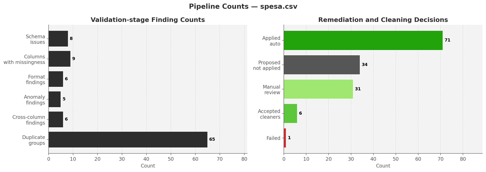
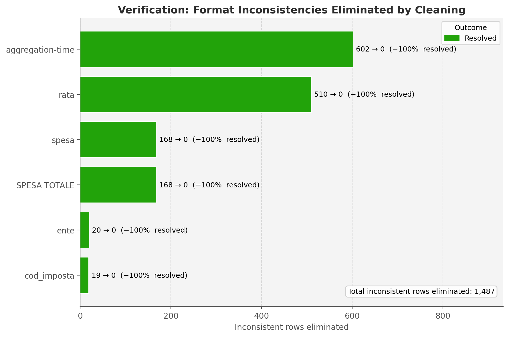
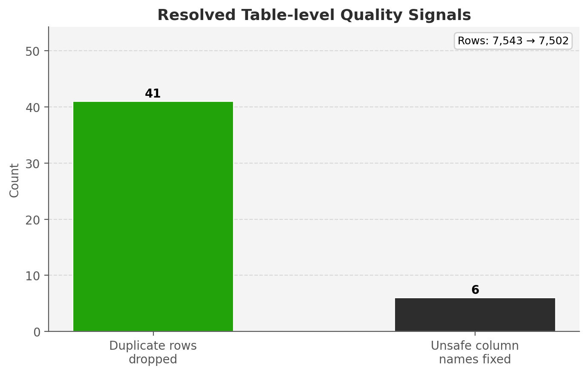
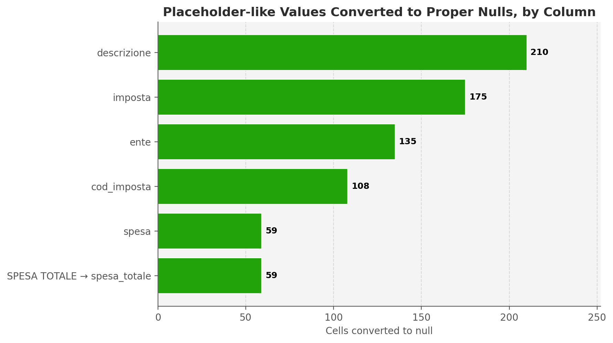
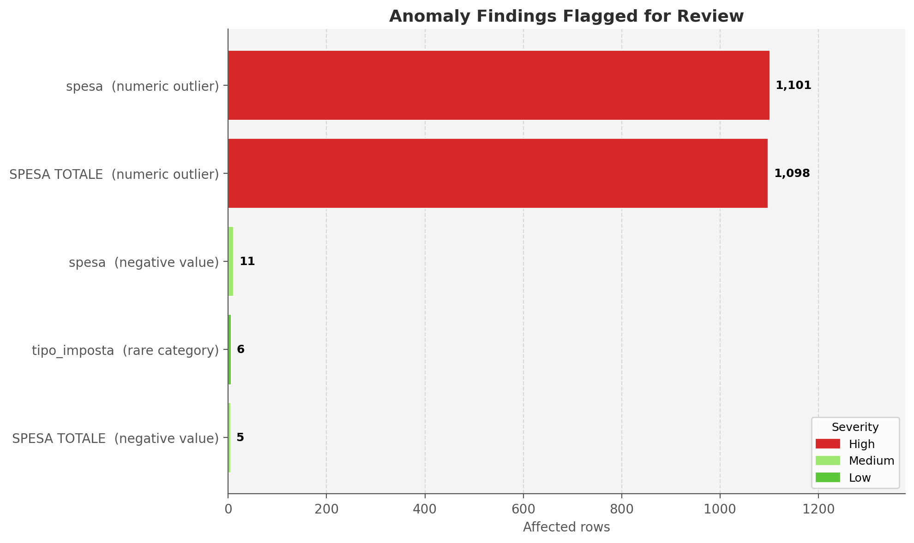
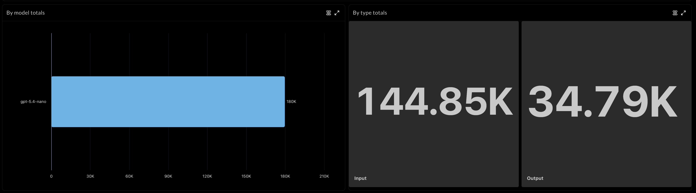
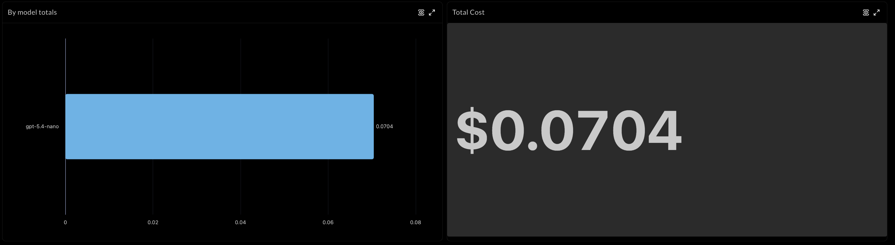
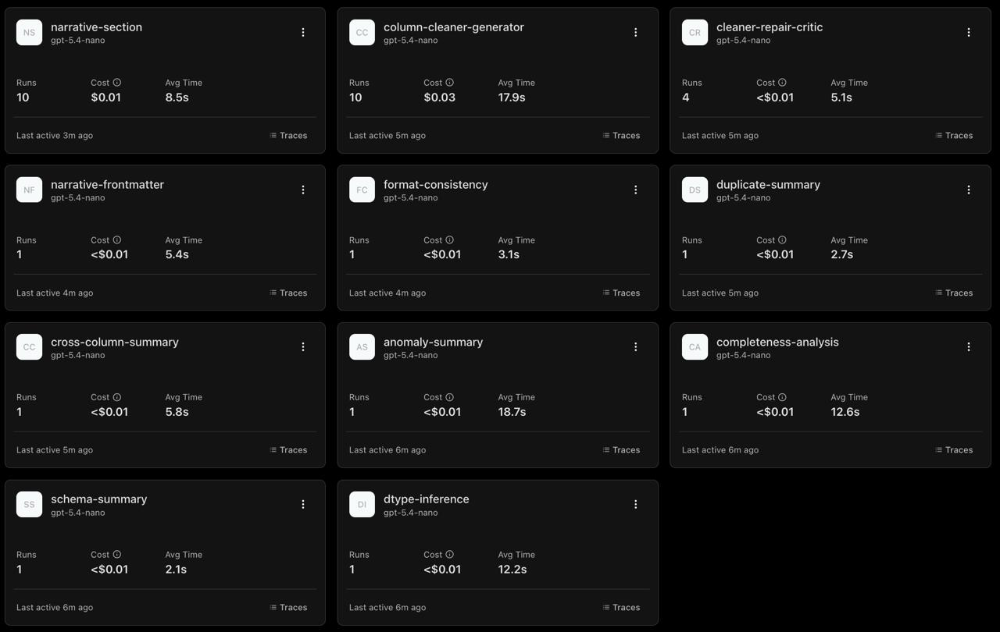
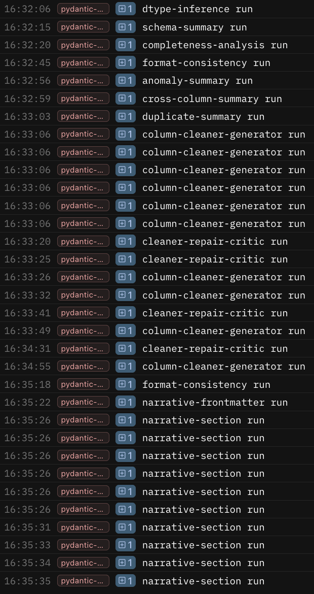

# Experiments and results

These are historical development observations and reported cached-run results migrated from the original project README. No new model-backed experiment was run for this documentation migration. Figures, example artifacts, and current code may represent different development snapshots. Costs are observed historical amounts, not current pricing or a budget guarantee. Reproducing the measurements requires the original inputs, artifacts, environment, and model configuration.

## Experimental Design

The main purpose of the project was not only to build a data-cleaning pipeline, but to understand which **architectural choices** make LLM-assisted cleaning reliable enough to be useful on heterogeneous real tabular data. In practice, the project evolved through a **trial-and-error process** in which several initial designs were found to be too expensive, too brittle, or too difficult to validate, and were then replaced by more constrained alternatives.

More specifically, the experiments were used to validate the target contribution of the project: a staged pipeline in which **local deterministic analysis**, **bounded agent reasoning**, **constrained code generation**, **host-side validation**, and **post-application verification** are combined so that cleaning decisions are both affordable and auditable. The final system should therefore be read not as a single model prompt, but as the result of iterative experimentation on how to distribute work between local code and LLM agents.

## From Full-Column Prompting to Bounded Profiling

The first experiment addressed the **cost** and **scalability** of schema and format inference. An early design gave the model entire raw columns, but this quickly produced very large prompts and **unsustainable token usage** on realistic datasets. The adopted solution was to replace that approach with a **mixed strategy**: the agent receives bounded unique-value samples, with a limit derived from 5% of the dataset row count and capped at 500 values per column where appropriate, combined with full-column deterministic statistics computed locally. See the [implemented sampling rule](validation.md#schema-validation).

- **Main Purpose**: determine whether the system could preserve useful semantic inference while drastically reducing prompt size.
- **Baseline**: the baseline was the earliest full-column prompting strategy, in which the model received much larger portions of raw column content directly.
- **Evaluation metrics**: the main evaluation criteria were **token consumption**, **prompt compactness**, and whether the agent still produced **useful schema and format interpretations**. These metrics were appropriate because the objective of this experiment was not to maximize raw recall over every column value, but to make LLM reasoning affordable while preserving enough evidence to infer the intended semantic type and dominant format of a column.
- **Resulting design decision**: this experiment led to one of the central design choices of the final system: the LLM is not given full columns when the task is **conceptual inference**. Instead, the system provides bounded representative evidence, while local code computes global statistics over the entire dataset. This division of labor reduced cost and made the pipeline feasible on larger datasets.

## From Direct Cleaning to Example-Guided Code Generation

The second experiment asked whether the **cleaning stage** should reason over broader raw column contents or instead generate **executable code** from a **compact contract**. The adopted solution was the latter: construct a `ColumnCleaningRequest` containing the **target format**, **dominant valid examples**, **representative inconsistent examples**, and **explicit preservation requirements**, and then generate one self-contained Python function from that request.

- **Main Purpose**: determine whether the cleaning stage could become more reproducible, inspectable, and reusable by generating executable code from a narrow contract instead of from a broader and more open-ended prompt.
- **Baseline**: the baseline was a less structured design in which the model was given broader raw evidence and a more open-ended cleaning task.
- **Evaluation metrics**: the most relevant metrics were **cleaner acceptance rate**, **number of validation failures**, and whether **already-valid values were preserved**. These metrics were appropriate because the main risk was not simply failure to transform outliers, but accidental damage to values that were already correct.
- **Resulting design decision**: this experiment led to a **cleaner-generation process** in which the LLM sees only **distilled examples** and **structural instructions**, not the whole column. The generated code is then **host-validated locally** on representative valid and inconsistent examples before it is accepted for application. This makes the generation stage **cheaper**, **more inspectable**, and more compatible with **explicit correctness checks**.

## From One-Shot Generation to Validator and Critic Loops

The third experiment was motivated by a recurring **development problem**: **one-shot code generation** often produced cleaners that looked plausible but still failed operationally. The improved design was to **validate generated code locally after each attempt** and, when issues were found, pass the **authoritative validation failures** to a **repair critic** that guides the next attempt.

- **Main Purpose**: determine whether an explicit host-side validator and repair loop would improve reliability compared with simply accepting or rejecting one-shot generations.
- **Baseline**: the baseline was one-shot generation without a structured repair process.
- **Evaluation metrics**: the main metrics were **first-pass acceptance rate**, **total retry count**, **frequency of repeated failure patterns**, and the **verification outcome after application**. These metrics were appropriate because they capture both engineering efficiency and behavioral quality: a cleaner that compiles but repeatedly fails preservation or formatting constraints is not useful, and a cleaner that appears valid but does not improve the final dataset is also not a success.
- **Resulting design decision**: this experiment produced the **generation-validation-critic loop** implemented in the codebase. It also motivated the **stagnation-control logic**: when retries keep reproducing essentially the same failure, the system injects a **structural unblock brief** and adjusts the **temperature conservatively** rather than repeating the same attempt indefinitely.

## From Cleaning Acceptance to Post-Application Verification

The fourth experiment asked whether **local acceptance on representative examples** was sufficient to trust a cleaner, or whether the **cleaned dataset** still needed to be **re-evaluated after full-column execution**. The adopted solution was to apply accepted cleaners to the real dataset and then **re-run consistency checks** on the cleaned output to compare **before-versus-after findings**.

- **Main Purpose**: validate the decision to include a separate verification stage rather than treating local example-based acceptance as final success.
- **Baseline**: the baseline was the implicit assumption that a cleaner passing local example-based validation could be treated as successful.
- **Evaluation metrics**: the main metrics were verification outcomes classified as **resolved**, **improved**, **unchanged**, or **regressed**. These metrics were appropriate because they directly measure the target contribution of the project: not merely generating code, but producing measurable improvements in data quality without introducing regressions.
- **Resulting design decision**: this experiment confirmed that **acceptance at the code level** should not be treated as **final success**. In the implemented pipeline, the true success criterion is **post-application verification** on the cleaned dataset, not just a plausible generated function.

## Summary of the Experimental Logic and Important Design Decisions Shaped by Trial and Error
Several additional decisions in the final system were also motivated by **observed failure modes** during development.

1. The system moved toward **richer cleaning requests** because simpler pattern descriptions were not sufficient to protect **already-valid values**. In particular, **datetime-like** and **period-like columns** required **explicit dominant examples**, **target shape expectations**, and **recovery rules** for partially informative values. Without this richer contract, the generator could normalize outliers while damaging valid entries.
2. **Duplicate handling** became more **explicit** and **deterministic** over time. **Exact duplicate rows and columns** were separated from more ambiguous **near-duplicate** or **semantic-conflict** cases, allowing the system to auto-apply only the **lowest-risk actions** while leaving ambiguous situations for **manual review**.
3. The system adopted a stronger separation between **factual reporting** and **narrative reporting**. This decision emerged from the need to keep final claims grounded in **structured artifacts** rather than letting **free-form text** become the primary source of truth. The final narrative is therefore generated only after the factual `FinalPipelineReport` has already been assembled.

Taken together, these experiments do not represent a **classical benchmark-only evaluation**. Instead, they document the **iterative process** through which the project's final contribution emerged: a **token-conscious**, **safety-oriented**, **auditable** LLM cleaning pipeline whose architecture was refined in response to concrete **cost**, **reliability**, and **validation** problems observed during development.

## Results

The quantitative illustrations reported in this section are drawn from the cached end-to-end run on **`spesa.csv`**, because this dataset provides the clearest basis for visual and metric-based discussion. Comparable remediation behavior was obtained across the project datasets, but `spesa.csv` is used here as the most readable case for showing how the pipeline behaves when diagnosis, controlled intervention, and post-application verification are considered together.

## Changes Applied

The most important pattern is the gap between what the pipeline can detect and what it is willing to change automatically. The counts below indicate that diagnosis is deliberately broader than intervention: findings are accumulated aggressively, but execution remains selective.

This asymmetry reflects a **safety-first policy** rather than a coverage failure. The **left panel** is visually dominated by **duplicate groups (65)**, while the other finding families are much smaller: **8 schema issues**, **9 columns with missingness**, and **6 findings each** for format consistency, anomalies, and cross-column checks. The **right panel** shows the same selectivity from the remediation side: **71 applied actions**, **34 proposed-but-not-applied actions**, **31 manual-review items**, **6 accepted cleaners**, and only **1 failed action**. A useful question here is why the duplicate signal is so much larger than the others. The answer is that duplicate handling is allowed to surface both **row-level** and **column-level** redundancy broadly, whereas automatic cleaning remains much narrower and is reserved for cases where the normalization target is explicit and verifiable.

That **65-group duplicate signal** is itself internally structured. Of those groups, **41** are **exact row duplicates** after whitespace and case normalization, while **24** are **near-duplicate row groups** that share the same key columns but differ elsewhere in the record. Importantly, these counts do **not** include duplicate columns: column-level duplication is tracked separately through actions such as `drop_exact_duplicate_column`.

One concrete case visible in the action counts is the handling of **`cod imposta ext`**. That column was found to be an **exact duplicate** of **`2cod_imposta`** with **100% similarity**, so the remediation plan correctly scheduled a `drop_exact_duplicate_column` action and the duplicate column was removed. A separate rename action for `cod imposta ext -> cod_imposta_ext` had also been planned earlier by the schema stage, but by the time the rename step executed, the column had already been dropped as a duplicate. The rename was therefore recorded as **failed**, but this is a **benign sequencing artifact** rather than a real remediation failure: the correct outcome was that the duplicate column no longer existed.

The **34 proposed-but-not-applied actions** also become easier to interpret once they are unpacked. They consist of **31 `manual_review` actions** and **3 `report_only` actions**. More specifically, the manual-review queue contains **24** duplicate-detection cases, **5** cross-column validation cases, and **2** anomaly cases. The three `report_only` actions come from anomaly detection. This breakdown reinforces the same design logic visible in the figure: the pipeline is willing to **surface many risks**, but it auto-applies only the subset for which a safe intervention rule is already available.

The second pattern is that the strongest verified improvements concentrate on a narrow subset of columns rather than spreading evenly across the dataset. The impact clusters where the data exhibit repetitive and format-like irregularities that can be described through a stable target representation and then checked again after cleaning.

This concentration is informative because it reveals where the architecture is strongest. The chart is driven above all by **`aggregation-time` (602 rows eliminated)** and **`rata` (510)**, with a second tier formed by **`spesa`** and **`SPESA TOTALE`** at **168 each**, while **`ente` (20)** and **`cod_imposta` (19)** are much smaller cleanups. All six bars end at **zero residual inconsistent rows**, so the image is not just showing that something improved, but that the pipeline completely resolved the targeted inconsistency families it decided to clean. This is exactly the kind of column profile for which the architecture is strongest: once the validation layer can define a **narrow normalization objective**, cleaner generation becomes both more reliable and more verifiable.

The dataset-level comparison confirms the same pattern from a broader perspective. The strongest changes occur in defects for which the system can impose a canonical representation without introducing new semantic assumptions.

This image makes that point very concretely: the two resolved table-level signals are **41 duplicate rows dropped** and **6 unsafe column names fixed**. In other words, the visible gains at this level are not vague quality improvements, but very specific corrections to **redundancy** and **schema hygiene**. This pattern suggests that the pipeline is most effective when the defect is **technical rather than epistemic**. Duplicate removal, naming normalization, and tightly scoped format repairs respond well to explicit rules or to validation-guided cleaner generation because the target state is narrow and observable.

The placeholder analysis reinforces the same conclusion from a different angle. The cleaned dataset does not become dramatically more complete in aggregate because the pipeline does not fabricate missing information; instead, it standardizes how absence is represented and avoids collapsing every suspicious token into null when preservation is uncertain.

The column distribution is also informative. The largest substitutions occur in **`descrizione` (210)**, **`imposta` (175)**, **`ente` (135)**, and **`cod_imposta` (108)**, with smaller but still visible conversions in **`spesa`** and **`SPESA TOTALE`** at **59 each**. So the image does not suggest a diffuse blanket conversion policy; it shows a few columns carrying most of the placeholder cleanup burden. The implication is that a small movement in global missing-like counts should not be read as weak performance. In this setting, **representational coherence** is more meaningful than a large cosmetic decrease in missingness metrics, and the trade-off again favors **conservative interpretation** over **aggressive alteration**.

The same safety-first policy appears in anomaly handling. Extreme numeric values, rare labels, and negative values in otherwise non-negative measures are surfaced as review findings rather than being rewritten automatically, so anomaly detection broadens visibility without overreaching into unsafe remediation.

Here too, the image is highly concentrated rather than diffuse. The two dominant anomaly bars are **high-severity numeric outliers** in **`spesa` (1101 rows)** and **`SPESA TOTALE` (1098 rows)**. The remaining findings are much smaller: **11 negative values** in `spesa`, **6 rare-category rows** in `tipo_imposta`, and **5 negative values** in `SPESA TOTALE`. The close symmetry between `spesa` and `SPESA TOTALE` is not accidental: they carry essentially the **same extreme values** and behave like **functionally duplicate measures**, which is also consistent with the fact that the cleaning stage changed **227 rows** in each column independently.

A useful interpretive question is whether those two very large outlier signals should have triggered automatic cleaning. The design answer is **no**. The large positive values are plausible as **budget-level expenditure figures**, while the negative values are certainly more suspicious but still not safe to rewrite automatically without domain knowledge about legitimate reversals, adjustments, or compensations. For that reason, the pipeline correctly keeps these findings in the **review-only** layer: it treats them as **meaningfully ambiguous numeric extremes**, not as straightforward formatting defects.

## Token Usage and System Costs

At the **run level**, the first thing to notice is the **overall token and cost profile**: the total usage remains modest and the cost is well below one dollar, even though the system performs multiple reasoning and generation steps over a real dataset. The dashboards show that the heavier model expenditure is concentrated in a limited portion of the workflow rather than spread uniformly across all stages.

| Token dashboard | Cost dashboard |
|---|---|
|  |  |

These dashboards clarify why the total cost remains analytically relevant even though it is modest in absolute terms. The key point is not only that the observed run cost is about **$0.0704**, but that the run-level profile does **not** show a flat accumulation of cost across the whole pipeline. Instead, it shows a design in which model usage stays controlled until the workflow reaches the stages where semantic reasoning is genuinely required. The architecture makes that feasible because expensive calls are reserved for **narrow, information-dense tasks** rather than for indiscriminate full-dataset prompting. Cost efficiency is therefore produced by **architectural filtering**: deterministic stages absorb the bulk of raw inspection work, and the model is invoked only after the search space has already been compressed into actionable questions.

At the **per-agent level**, the division of cost reinforces the same interpretation. The **`column-cleaner-generator`** is the dominant cost center at about **$0.03** over **10 runs**, which means that the main budget is spent where the system performs the most difficult task: **synthesizing executable repairs under preservation constraints**. The **`narrative-section`** agent is the next visible recurring contributor at about **$0.01**, while the **`cleaner-repair-critic`** remains below **$0.01** despite multiple calls, indicating that diagnosis is cheaper than generation. The remaining validation and summary agents are individually negligible. The image therefore makes a useful architectural point: the pipeline does **not** spend money evenly across all stages, but concentrates spending where **semantic reasoning** and **code synthesis** are genuinely necessary while keeping descriptive and diagnostic support comparatively light.

This cost profile is consistent with the system design. Deterministic validators do not consume LLM budget at all, because they are local Python stages that inspect data and apply explicit rules. The expensive part begins only when the system asks the model to synthesize executable repairs that must preserve already-valid values and then survive host-side checks. The trade-off is therefore not between low cost and high capability in the abstract, but between a narrowly targeted use of a powerful model and a much less disciplined architecture that would have allowed token usage to scale with raw data exposure instead of with validated cleaning opportunities.

## Time Distribution of Model Activity

The historical temporal trace illustrates how time was distributed across model calls; it does not establish a general runtime guarantee. What stands out is the clustering of activity: the early validation and summary agents complete quickly, while the longer delays accumulate only once the pipeline reaches cleaner generation and, in some cases, re-enters the repair cycle. This pattern is expected, because the system spends very little time deciding whether an issue exists and more time when it must produce a safe executable correction.

Retry counts can change latency between runs. The system supports bounded parallel workers for independent column-level agent tasks, so runtime is influenced less by the sum of all per-column calls than by the slowest active branch in a stage. The implication is that the system gains speed through orchestration rather than through simplification: it does not remove the critic loop or the verification logic in order to appear fast, but contains their time cost by overlapping independent work where the architecture allows it. The trade-off is that exact runtime can fluctuate from run to run when different columns trigger different numbers of retries, yet the overall process remains fast enough to be operationally plausible because concurrency prevents that variability from compounding linearly.

## Summary of Run Outcomes

The table below consolidates the quantitative outcomes of the end-to-end run on `spesa.csv`, extracted from the cached pipeline artifacts.

| Metric | Value |
|--------|-------|
| Raw rows | 7,543 |
| Cleaned rows | 7,502 |
| Raw missing-like cells | 17,811 |
| Cleaned missing-like cells | 17,752 |
| Raw exact duplicate rows | 41 |
| Cleaned exact duplicate rows | 0 |
| Accepted cleaners | 6 |
| Rows changed by cleaners | 1,848 |
| Targeted inconsistent rows before cleaning | 1,487 |
| Targeted inconsistent rows after cleaning | 0 |
| Overall reduction on targeted inconsistencies | 100.00% |
| Applied actions | 71 |

The reduction from **1,487 targeted inconsistent rows to 0** should be read together with the conservative intervention policy described in [changes applied](experiments-and-results.md#changes-applied): auto-application is restricted to findings where the normalization target is unambiguous and verifiable. It is also important to distinguish this metric from the broader **rows changed by cleaners** measure. The reported cached artifacts show that the **6 accepted cleaners** changed **1,848 rows in total**, whereas **1,487** refers specifically to the rows counted as targeted inconsistencies before verification. The difference is meaningful: cleaner activity is broader than the narrower before/after inconsistency count used in the verification figure.

The concentration of that cleaning impact is also informative. A small number of columns carry most of the burden: **`aggregation-time` (602 rows)** and **`rata` (510)** together already account for the majority of the eliminated inconsistencies, while **`spesa`** and **`SPESA TOTALE`** each contribute **227 changed rows**. This explains why only **6 cleaners** were enough to remove such a large number of inconsistent values: the problem is not uniformly distributed across the dataset, but concentrated in a few **high-impact format-variant columns**.

The modest decrease in missing-like cells (**17,811 to 17,752**) reflects the same conservatism: the pipeline standardizes how absence is represented rather than fabricating fill values. The row count reduction from **7,543 to 7,502** is explained entirely by **exact duplicate removal**.

## Main Takeaway

The main conclusion supported by the quantitative figures is that the system does not merely propose a careful multi-agent architecture in the abstract, but demonstrates a **specific operational pattern**: it applies automation aggressively only where the target is narrow, verifiable, and low-risk, while leaving semantically ambiguous cases in the **review layer**. In the cached `spesa.csv` run, the pipeline accepted **6 cleaners**, applied **71 actions**, changed **1,848 rows** through those accepted cleaners, and reduced the targeted format inconsistencies from **1,487 rows to 0**, yielding a **100% reduction** on the inconsistency families it explicitly chose to remediate.

The shape of that improvement is also important. Most of the impact is concentrated in a few **high-burden format columns**, especially **`aggregation-time` (602 inconsistent rows resolved)** and **`rata` (510)**, with additional contributions from **`spesa`**, **`SPESA TOTALE`**, **`ente`**, and **`cod_imposta`**. At the same time, anomaly-heavy columns such as `spesa` and `SPESA TOTALE` remained **review-only**, and the duplicate signal remained broad because the system deliberately distinguishes between **safe structural removals** and **ambiguous semantic conflicts**. The result is not a claim of universal autonomous cleaning. It is evidence that **agentic reasoning can be integrated into a safety-oriented public-data workflow** in which both **data-quality impact** and **execution behavior** remain inspectable, with the total model cost for the observed run remaining modest at about **$0.0704**.

---

[Documentation index](README.md) · [Run the application](../README.md#setup)
