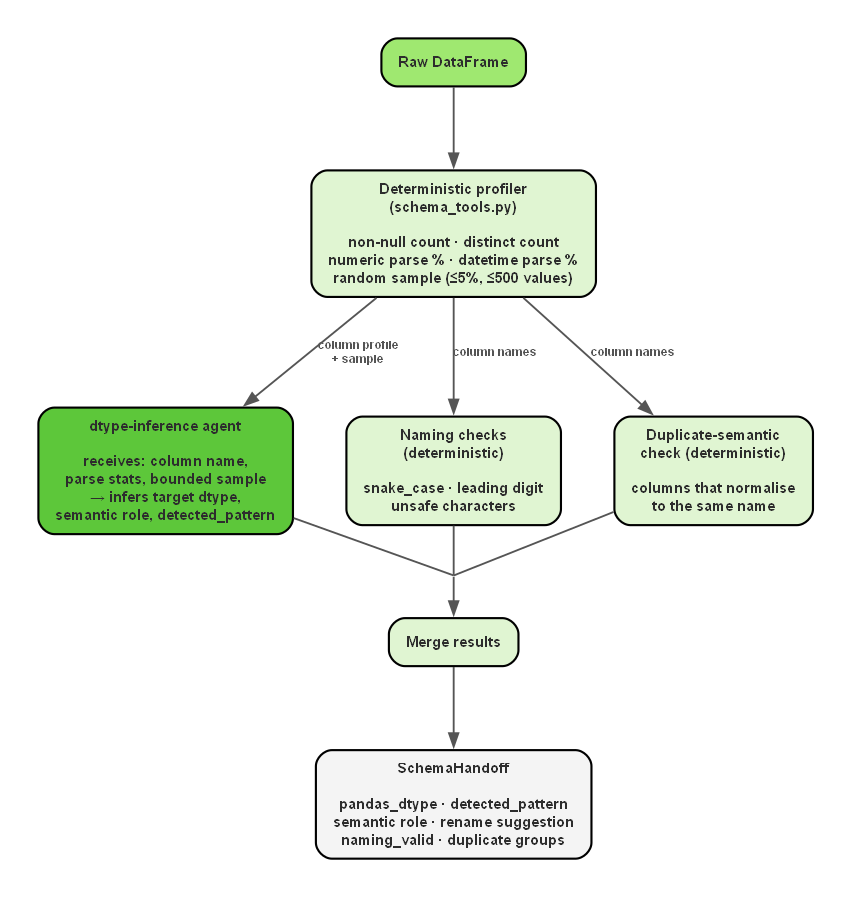
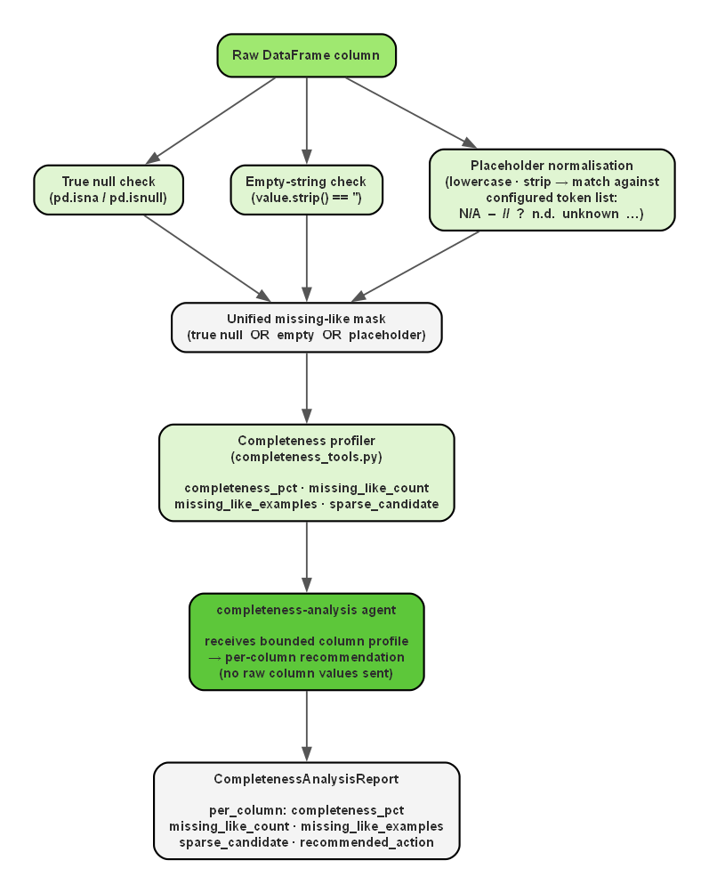
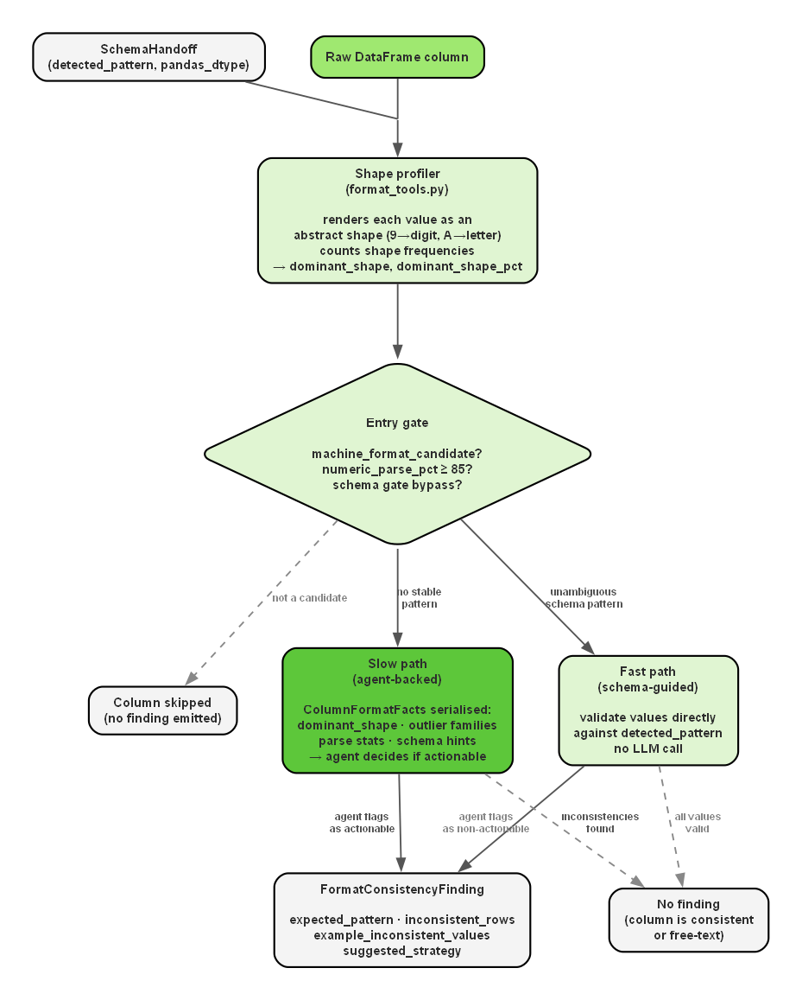
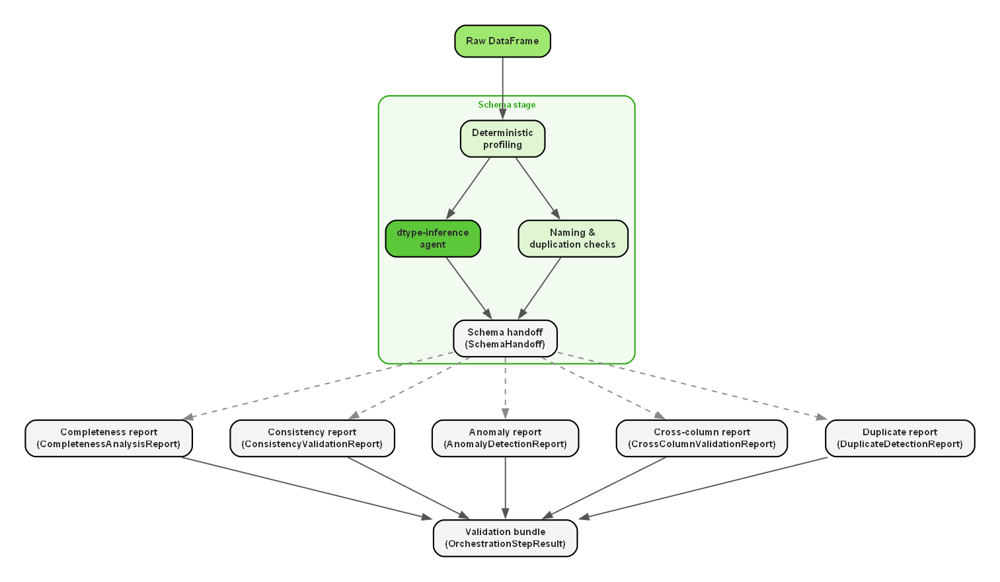

# Validation

Examples below illustrate typed artifacts from project development; they are not a single reproducible run fixture.

## Data Ingestion and Initial Framing

The **dataset** is loaded into a pandas dataframe and becomes the **authoritative input for validation**.

In the **verification stage**, the **cleaned output may be re-read** as **strings** so that **formatting differences** are not hidden by automatic dtype normalization. This detail is important because the **system evaluates** not only semantic compatibility but also whether the cleaned values respect the **intended canonical representation**. In other words, the **system** is **not satisfied** by a **value that merely parses**; it also **cares** whether the **value has been normalized into the correct target form**.

## Schema Validation
After the raw dataframe has been loaded and framed, **schema validation** becomes the **first domain-facing stage**. Its **purpose** is to **establish what each column is supposed** to **represent after cleaning**, rather than merely describing how the raw values happened to be stored. This **distinction is fundamental**. A column may be loaded as strings while still being, in substance, a date field or a numeric field corrupted by a minority of messy values. What the **system tries to understand** is what a **certain column is meant to represent rather than how it happens to be encoded** in the raw data. The **schema handoff makes this visible** in a concrete way.

Each column that passes through the schema stage produces a `SchemaHandoff` entry. The most important fields in that entry are `pandas_dtype`, which is the inferred target dtype after cleaning, and `detected_pattern`, which is the canonical form the cleaned values should follow. Both fields are produced by the `dtype-inference` agent from the bounded column profile.

``` json
    {
      "name": "aggregation-time",
      "pandas_dtype": "datetime64[ns]",
      "numeric_role": null,
      "string_role": null,
      "detected_pattern": "ISO 8601 / date-time",
      "rationale": "Datetime parse is 99.0% with clear timestamp/date strings (e.g., '2024-03-11T02:01:04.421', '24.10.2024'). Minority non-standard formats are treated as corruption; cleaned dtype is datetime64[ns].",
      "non_null_rows": 7543,
      "distinct_non_null_values": 66,
      "numeric_parse_pct": 0.0,
      "datetime_parse_pct": 99.03221529895268,
      "empty_like_pct": 0.0,
      "sample_values": [
        "2024-03-11T02:01:04.421",
        "2024-07-11T03:01:16.866",
        "2024-09-11T03:01:11.704",
        "2024-05-11T03:01:07.269",
        "2024-11-11T02:00:28.485"
      ],
      "naming_valid": false,
      "rename_suggestion": "aggregation_time",
      "naming_reason": "Column name contains a hyphen, which violates the lowercase snake_case naming rule."
    }
```
The `detected_pattern` field is the value that the consistency stage ([format consistency validation](validation.md#format-consistency-validation)) will later use as a semantic contract when deciding whether observed value shapes count as inconsistent.

The stage begins with **deterministic profiling** in `src/tools/schema_tools.py`. It computes non-null counts, distinct counts, numeric parse percentages, datetime parse percentages, and representative value samples.

One particularly important **design choice** is that the `dtype-inference` prompt does **not receive the whole column**. It receives distinct non-null, non-empty values sampled per column. The sample limit is `min(500, max(1, ceil(row_count * 0.05)))`; when there are more distinct values than this limit, sampling uses `random_state=42`. The column name and whole-column parse statistics accompany those values. This is a bounded sample of unique values, not a row-frequency-preserving sample.

This is a deliberate **compromise between interpretability and cost efficiency**. The system does not require to spend **tokens** on entire columns when the purpose of the stage is conceptual inference rather than exhaustive memorization, so it gives the LLM a **bounded local view** through the sample and a **global statistical view** through whole-column parse percentages. The sample is not enough to reproduce the full empirical distribution of a large column, but it is often enough to show what the column is trying to represent. If, for example, the raw pandas dtype is `object` but the sampled values are all strings corresponding to numbers between `1` and `12`, the agent can reasonably infer that the true cleaned dtype should be `Int64` rather than free text. In the same way, a column whose raw values are strings may still clearly reveal itself as a date field, a code, or a decimal measure once the sampled values are read together with the column name. This is what allows the system to remain relatively economical while **still making a semantically informed dtype decision**.

The same `dtype-inference` call **returns** not only the **target cleaned pandas dtype**, but also the **semantic role of the column and a dominant canonical pattern** when that pattern is clear enough. In other words, the dominant pattern is not deferred to a second dtype-inference call. It is **already part of the schema-stage inference**. In parallel, **deterministic naming checks identify unsafe column names** and **duplicate-semantic groups**. The **result** is merged into a structured `SchemaHandoff`.



This **hybrid design is deliberate**. **Parse rates and naming rules** are **straightforward deterministic checks**. Interpreting a messy profile as a cleaned target dtype benefits from semantic reasoning, but only when that reasoning is grounded in bounded evidence rather than raw unrestricted data.

## Completeness Analysis

Completeness analysis exists because missingness in real datasets is often **disguised**, so a naive null count is usually insufficient. The system therefore defines a **list of potential placeholder tokens** such as `N/A`, `-`, `unknown`, and empty strings, normalizes raw cell values against that list, and treats matches as **missing-like** rather than genuine content. This matters because many administrative datasets contain cells that are technically non-null but still informationally empty.

Starting from this placeholder list, `src/tools/completeness_tools.py` **builds a deterministic completeness profile**. It computes completeness percentages, detects missing-like tokens, records representative placeholder examples, and marks sparse columns. More specifically, the completeness logic constructs a **missing-like mask** that merges true nulls, empty strings, and configured placeholder values into one unified notion of absence.



This profile is then **interpreted** by the `completeness-analysis` agent, which **returns** a **structured report with per-column recommendations**.

``` json
    {
      "column_name": "ente",
      "completeness_pct": 96.26143444252949,
      "missing_like_count": 282,
      "missing_like_examples": [
        "unknown",
        "",
        "//",
        "?",
        "n.d.",
        "-"
      ],
      "sparse_candidate": false,
      "recommended_action": "Targeted review of missing/placeholder-like values in this column; standardize placeholder tokens (e.g., unknown, //, n.d., -) and empty strings upstream."
    }
```

The **role of the agent** at this stage is not to discover missingness independently, but to transform **measured evidence** into a downstream-readable handoff. The **practical benefit** is that later stages do not need to repeat the same reasoning. They receive an **explicit statement** of which columns contain hidden missingness, which placeholder families are present, and whether some columns should be reviewed because they contain almost no meaningful information.

## Format Consistency Validation

**Format consistency validation** connects diagnosis to executable cleaning. Its purpose is to **identify columns whose values are semantically similar but structurally inconsistent** in ways that justify normalization. Typical examples include mixed date layouts, mixed encodings for period identifiers, or numeric fields that include punctuation or textual noise.

### Inputs from the Schema Handoff

The consistency stage does not start from scratch. It receives the **schema handoff** described in [schema validation](validation.md#schema-validation), which already carries the **target cleaned dtype** and, when available, the **`detected_pattern`** inferred during schema inference. That pattern is semantic and canonical: it expresses what the column should mean and what form its values should take after normalization — for example `YYYYMM period key`, `4-digit year`, or `month number (1-12)`. The consistency stage then **complements that semantic contract with a raw structural profile** computed directly from the observed values in `src/tools/format_tools.py`.

### Shape Profiling

The structural profile is built by **rendering non-null, non-empty values as strings** and **abstracting them through a shape function**. The shape function replaces every digit with a representative digit placeholder and every letter with a letter placeholder, preserving the number of characters and punctuation, so that surface structure is captured without retaining actual content. For example, `202402` becomes `999999`, `04/2024` becomes `99/9999`, and `2025-06-18T16:15:20.148346` becomes a timestamp shape. The profiler counts how often each shape appears, ranks them by frequency, and defines the **`dominant_shape`** as the most frequent one among the filtered values. Its relative prevalence is stored as **`dominant_shape_pct`**. Both fields appear in the `ColumnFormatFacts` object passed to the agent on the slow path.

The **relationship between `detected_pattern` and `dominant_shape`** operates at different levels of abstraction and the two fields answer different questions:

- **`detected_pattern`** answers *"what should this column look like?"* — produced by the LLM from a bounded profile and a column name, it is the normalization target.
- **`dominant_shape`** answers *"what does this column look like right now, in the majority of rows?"* — produced deterministically from the raw values as they actually appear.

In practice, the two can align closely or diverge significantly. For `rata` in `spesa.csv`, the `detected_pattern` is `YYYYMM period key` and the `dominant_shape` is `999999`: a direct match. For `mese` in `attivazioniCessazioni.csv`, the `detected_pattern` is `month number (1-12)`, but the raw shapes split between `9` for single-digit months such as `7` and `99` for two-digit months such as `11`, with additional textual shapes for forms like `NOV` or `Novembre`. There the `detected_pattern` declares the target, while the `dominant_shape` distribution reveals the extent of drift and which shape families should be treated as already valid versus inconsistent.

### Entry Gate Conditions

Before either execution path is taken, two gate conditions extend coverage beyond the shape-based heuristic alone.

1. **Schema-driven bypass for numeric columns.** When an `Int64` or `Float64` column already has a concrete `detected_pattern`, the stage skips the name-based `machine_format_candidate` heuristic and proceeds directly to schema-guided validation, even for columns whose names fall outside the recognized keyword vocabulary.
2. **`numeric_parse_pct` fallback threshold.** A column such as `month`, whose valid values split across shapes like `9` and `99`, may fail the dominant-shape threshold despite being clearly machine-readable. Adding `numeric_parse_pct >= 85` as a secondary gate lets such columns enter validation without changing the normalization target, so zero-padded values such as `03` can still be treated as inconsistent against a dominant `9`.

### Fast Path and Slow Path

The two gate conditions feed into two execution paths defined in `src/validation/consistency.py`. When the schema handoff already provides an **unambiguous `detected_pattern`**, the stage takes a **deterministic fast path** and uses that pattern directly as its validation contract, especially for numeric and code-like columns.



The `dominant_shape` confirms what the majority of rows already look like and which examples must be preserved rather than transformed. If **no stable schema pattern exists**, or if the pattern is too ambiguous to serve as a direct contract, the stage **falls back to the agent-backed slow path**.

### Agent Evidence Bundle (Slow Path)

On the slow path, the format-consistency agent does not receive the whole raw column. Instead it receives a **compact `ColumnFormatFacts` object** serialized as a plain-text JSON attachment, containing:

- target dtype hint, parse percentages, and empty-like percentage
- semantic hint (`detected_pattern`), dominant shape, and dominant-shape percentage
- representative dominant values and grouped inconsistent examples
- a compact summary of the most frequent raw value shapes

The **prompt** is equally explicit: it states the dataset name, column name, total row count, dominant shape, percentage of rows matching that shape, number of inconsistent rows, and, when available, the schema-stage target dtype and semantic role.

The following artifact illustrates this evidence bundle for the `RATA` column in `spesa.csv`, showing the exact balance the slow path relies on: **global column signals** such as parse rates and dominant-shape prevalence, together with **grouped concrete outliers** that reveal the main inconsistency families.

```json
{
  "column_name": "RATA",
  "pandas_dtype": "object",
  "total_rows": 7543,
  "non_null_rows": 7543,
  "distinct_non_null_values": 66,
  "numeric_parse_pct": 100.0,
  "datetime_parse_pct": 0.0,
  "empty_like_pct": 0.0,
  "semantic_hint": "temporal_period",
  "machine_format_candidate": true,
  "dominant_shape": "999999",
  "dominant_shape_pct": 89.4,
  "dominant_example_values": [
    "202311",
    "202307",
    "202308"
  ],
  "inconsistent_rows": 802,
  "inconsistent_examples": [
    { "value": "2023-09", "shape": "9999-99", "count": 143 },
    { "value": "DIC-2023", "shape": "AAA-9999", "count": 88 },
    { "value": "09/2024", "shape": "99/9999", "count": 67 }
  ],
  "top_value_shapes": [
    { "shape": "999999", "count": 224, "pct": 89.6, "sample_values": ["202311", "202307", "202308"] },
    { "shape": "9999-99", "count": 11, "pct": 4.4, "sample_values": ["2023-09", "2024-04"] },
    { "shape": "99/9999", "count": 8, "pct": 3.2, "sample_values": ["09/2024", "12/2023"] }
  ]
}
```

The amount of evidence is deliberately bounded. Dominant examples are capped at five values, outlier families are grouped and trimmed through `select_outlier_examples(...)`, and the top-shape profile is summarized from a bounded sample rather than the full rendered column. The slow path is therefore **not an unconstrained semantic guess**, but a bounded decision over a pre-structured evidence bundle.

### Selectivity and the Trigger Condition

Not every variation should trigger cleaning. Free-text fields, notes, names, or descriptive categorical columns may contain diverse content without containing any format error. The stage therefore emits a `FormatConsistencyFinding` only when a **clear canonical representation exists** and a **measurable inconsistent minority can reasonably be normalized toward it**. This is the core trigger for later cleaner generation.

## Anomaly Detection

**Anomaly detection** is separated from format normalization because **suspicious values are not automatically incorrect values**. A large outlier, a rare category, or an unusual code may indicate corruption, but it may also represent a **valid edge case**. **Automatic rewriting** in such cases would be **risky**.

``` json
    {
      "column_name": "spesa",
      "anomaly_type": "numeric_outlier",
      "severity": "high",
      "affected_rows": 1101,
      "example_values": [
        "43365008.73",
        "7639226.66",
        "3887279.49",
        "9518447.34",
        "10455819.51",
        "87912478.86",
        "6543617.570000316",
        "6807615.07"
      ],
      "evidence": "1101 rows fall outside the robust IQR band [-1879828.180, 2512978.350] computed from Q1=2803.190, Q3=630346.980.",
      "suggested_action": "Review whether these values are genuine extreme cases or unit/format errors before imputation or removal."
    }
```

The system **detects anomaly candidates deterministically** in `src/tools/quality_tools.py`. **Numeric outliers, suspicious negative values in mostly non-negative measures, and rare categorical values are not found by prompting an LLM**, but by **running explicit local rules** over the schema-aware dataset representation. The `anomaly-summary` agent is used only afterward to **write a concise structured summary of findings that have already been computed**.

The **numeric detector** applies only to columns that the **schema stage has already classified as numeric measures**. This means that **numeric codes and indicators are excluded deliberately**, because they may be numeric without behaving like continuous quantities. The detector also **requires a minimum amount of evidence before it runs**: at least 20 parseable numeric values and at least 10 distinct numeric values. Once those conditions are satisfied, the implementation computes the first quartile `Q1`, the third quartile `Q3`, and the interquartile range

$$ IQR = Q3 - Q1 $$

Then it defines a conservative outlier band

$$ \text{lower} = Q1 - 3 \times IQR \quad;\quad \text{upper} = Q3 + 3 \times IQR$$

Any value outside that interval is **marked as an outlier candidate**. The use of $3 \times IQR$ rather than the more aggressive $1.5 \times IQR$ is **intentional**: the project **prefers to reduce false positives** on naturally skewed public-administration measures. In other words, the detector is **calibrated to surface suspicious extremes**, not to flag every moderately unusual value. The **severity** is then set to `high` when the outlier rows are at least 2 percent of the dataset and `medium` otherwise.

The **negative-value detector** complements this statistical rule with a **domain-shaped heuristic**. It looks only at columns whose **schema role is `measure`**, converts them to numeric values, and checks whether the column is **overwhelmingly non-negative overall**. When at least **95 percent** of parsed values are non-negative, any remaining **negative values are surfaced as anomaly candidates** rather than being ignored simply because they do not cross the IQR fence. This rule is still conservative: it does **not** assume that every negative value is wrong, but it does force explicit review when a mostly non-negative measure column contains a small pocket of negatives that may reflect sign errors, refunds, or adjustments. The **severity** is set to `high` when the column is at least **99 percent non-negative** and `medium` otherwise.

The **rare-category detector** follows a **different logic** because it is designed for **low- to moderate-cardinality textual columns** rather than for numeric distributions. It applies only to columns whose **dtype family is textual** and whose **schema role is not** `free_text`, `name`, or `identifier`. **Placeholder tokens are removed first** so that missing-like noise does not become an apparent category. The detector then checks that the column is **suitable for this heuristic at all**. It is **skipped** if the number of distinct labels is below 5, above 50, or so diverse that the distinct-value ratio exceeds 20 percent of the non-null rows. It is also skipped if the most common category occupies less than 20 percent of the column, because in that case the column has **no stable baseline from which "rare" can be defined meaningfully**.

If the column passes those eligibility checks, the **threshold for rarity** is computed as

$$ \text{rarethreshold} = \max(1, \lfloor 0.005 \times n \rfloor) $$

where `n` is the number of non-null, non-placeholder rendered values in the column. **Every category whose frequency is less than or equal** to that threshold is **treated as a rare-category candidate**. The total **number of rows covered by those rare labels** becomes the **affected-row count**. The **severity** is set to `medium` when at most 5 rows are affected and `low` otherwise, because rare labels are treated as **weak anomaly signals rather than as strong evidence of error**.

One additional implementation detail matters here. Before the final anomaly report is assembled, `src/validation/anomaly.py` **suppresses duplicate-semantic aliases** that were already identified in the schema handoff. This **prevents the same anomaly from being reported twice** merely because the dataset contains two columns that normalize to the same meaning. The output of the stage is therefore interpretive rather than generative. It **highlights potential risk signals that deserve attention**, but it does **not convert those signals directly into cleaning code**.

## Cross-Column Validation and Duplicate Detection

A dataset may contain columns that look reasonable in **isolation** and still contradict one another when compared. Similarly, **row-level redundancy** introduces a different class of quality issue from format inconsistency.
For this reason, the system includes **deterministic cross-column checks and duplicate detection** in `src/tools/quality_tools.py`. No LLM performs these checks. The corresponding agents, `cross-column-summary` and `duplicate-summary`, are used only afterward to summarize findings that have already been computed by Python.

The **cross-column stage** therefore applies **explicit programmatic rules**. **Exact and near-duplicate columns** are detected by first restricting the comparison to **eligible pairs**, meaning columns that belong to the same broad dtype family and are not obviously incomparable, such as free-text columns or a numeric measure compared against a numeric code. Values are **normalized for case and whitespace**, and the comparison is performed only on rows where **both columns contain** a **real non-placeholder value**. At least 20 comparable rows must exist, and the overlap between the two columns must cover at least 80 percent of the smaller present-value set. If the **two normalized columns agree on every comparable row**, they are **flagged as exact duplicate columns**. If they do not agree perfectly but **still agree on at least 95 percent of comparable rows**, and the number of mismatches stays below `max(10, ceil(0.05 * comparable_rows))`, they are flagged as **near-duplicate columns**.

``` json
    {
      "columns": [
        "provincia_sede",
        "Provincia Sede"
      ],
      "check_type": "duplicate_semantic_conflict",
      "severity": "high",
      "affected_rows": 105,
      "example_row_indices": [
        110,
        349,
        500,
        531,
        547,
        954,
        1437,
        1608
      ],
      "similarity_pct": 99.44,
      "evidence": "Columns 'provincia_sede' and 'Provincia Sede' normalize to the same schema name but disagree on 105 of 18842 rows where both values are present (99.44% similarity).",
      "suggested_action": "Review whether one column should override the other, whether they need reconciliation rules, or whether both must be preserved separately."
    }
```

The **same deterministic approach** is used for the **relational checks**. **Year-month-period mismatches** are detected by rebuilding the expected `YYYYMM` key from the year and month columns and comparing it directly against the stored period key. **Date-order violations** are detected by checking whether a likely start date occurs after a likely end date. These are **straightforward logical comparisons**, so the system **treats them as rule-based checks rather than as interpretive model tasks**.

The **duplicate stage** follows the same philosophy at row level. **Exact duplicate rows** are detected after case and whitespace-normalization of the full row signature. **Near-duplicate rows** are detected differently: the system first infers a small set of likely business-key columns, preferring identifiers, numeric codes, and temporal keys such as year, month, or `YYYYMM`. Rows that share the same **normalized key values** are **grouped together**, and if those rows differ elsewhere in the record they are **flagged as near-duplicate groups**. This means that near-duplicate rows are not simply "similar-looking" rows. They are rows that appear to refer to the same entity or event under the inferred key columns, while still containing some disagreement in the remaining fields.

## Validation bundle

After schema, completeness, consistency, anomaly, cross-column, and duplicate analyses have been completed, the **outputs are bundled into a unified validation artifact**. This bundling is necessary because the cleaning half of the pipeline should consume one coherent view of the dataset rather than several loosely connected reports.



`src/validation/bundle.py` persists the combined `OrchestrationStepResult`. Schema, completeness, and consistency can reuse cached artifacts through their respective flags. Anomaly, cross-column, and duplicate stages run fresh when this orchestrator is called. The resulting bundle is consumed by [remediation planning](cleaning-and-reporting.md#remediation-planning).

---

[Documentation index](README.md) · [Run the application](../README.md#setup)
